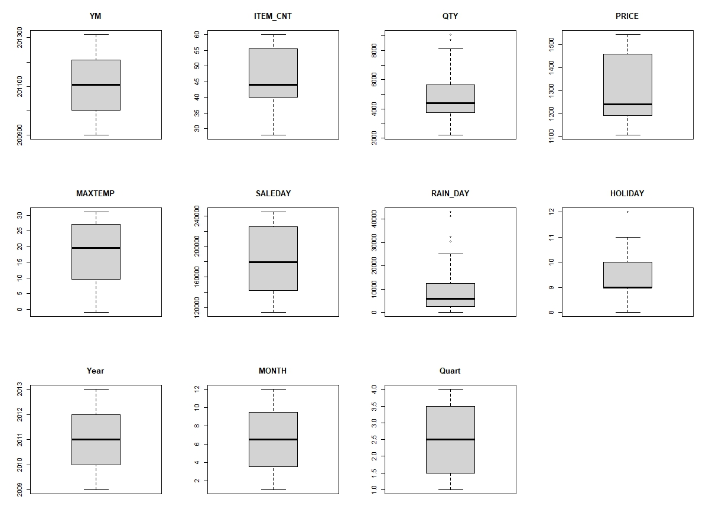

- CU편의점의 2009~2013 음료 판매데이터를 불러와 일반 탄산음료의 매출은 어떤 독립변수의 영향을 많이 받는지 확인하기 위해 회귀분석을 시행했습니다.

## 1. 목차

- 데이터 전처리 - 극단값, null 값 확인, 종속변수 정규성 확인

- 데이터 분석 - 상관분석, 모형 선택, 다중회귀분석

- 평가 - 회귀식 평가

## 2. 데이터 전처리

- ### 2-1 극단값 확인
  
  

- ### 2-2  null 값 확인
  
  

- ### 2-3 종속변수 정규성 테스트
  
  
  
  

## 3. 데이터 분석

- ### 3-1 상관분석

- ### 3-2 모형선택

- ### 3-3 다중회귀분석

## 4. 회귀식 평가
