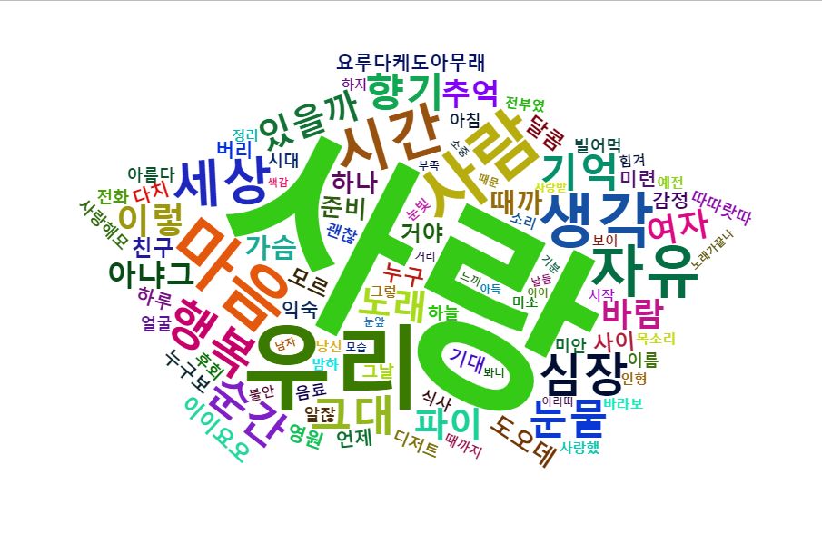

- 멜론차트에 웹피이지를 분석하고, 크롤링하여 노래가사를 추출한 다음 어떤 노래 가사가 가장 많이 쓰였는 지 확인해 봤습니다.

## 1. 목차

- Python WebCrawling

- R 패키지 wordcloud2

- 평가

## 2. Python WebCrawling

```python
### 웹페이지 불러오기
import requests as req
from bs4 import BeautifulSoup as bs
from selenium import webdriver
import webbrowser


headers={"User-Agent":"Mozilla/5.0 (Windows NT 10.0; Win64; x64) AppleWebKit/537.36 (KHTML, like Gecko) Chrome/113.0.0.0 Safari/537.36"}
url="https://www.melon.com/chart/index.htm"
res_melon=req.get(url,headers=headers)

res_melon
soup_melon=bs(res_melon.text,"html")
m_lyric=soup_melon.select("div.wrap>a[href]")
m_lyric

java_href=[]

for i in m_lyric:
        java_href.append(i.get("href"))

java_href=[data for data in java_href if "goSongDetail" in data]

print(java_href)
```

```python
### 웹페이지 불러오기
import requests as req
from bs4 import BeautifulSoup as bs
from selenium import webdriver
import webbrowser


headers={"User-Agent":"Mozilla/5.0 (Windows NT 10.0; Win64; x64) AppleWebKit/537.36 (KHTML, like Gecko) Chrome/113.0.0.0 Safari/537.36"}
url="https://www.melon.com/chart/index.htm"
res_melon=req.get(url,headers=headers)

res_melon
soup_melon=bs(res_melon.text,"html")
m_lyric=soup_melon.select("div.wrap>a[href]")
m_lyric

java_href=[]

for i in m_lyric:
        java_href.append(i.get("href"))

java_href=[data for data in java_href if "goSongDetail" in data]

print(java_href)
```

```python
### 문자열과 숫자열 분리
import re

def find_numbers_in_strings(data_list):
    numbers_list = []
    pattern = r'\d+'  # Regular expression pattern to match numbers

    for string in data_list:
        numbers = re.findall(pattern, string)
        numbers_list.extend(numbers)

    return numbers_list

#### Example usage
numbers_list = find_numbers_in_strings(java_href)
print(numbers_list)
```

```python
### URL과 분리한 숫자열 재결합
headers={"User-Agent":"Mozilla/5.0 (Windows NT 10.0; Win64; x64) AppleWebKit/537.36 (KHTML, like Gecko) Chrome/113.0.0.0 Safari/537.36"}
url="https://www.melon.com/song/detail.htm?songId="
url_list=[]
for i in numbers_list:
    url_list.append(url+i)


url_list
```

```
  Cell In[4], line 5
    if song_lyrics_element:
    ^
IndentationError: unexpected indent
```

```python
### 가사 불러오기
response=[]
song_lyrics_element=[]

for url in url_list:
    response=req.get(url,headers=headers)
    if response.status_code==200:
    # Create a BeautifulSoup object with the response text
        soup_response=bs(response.text,"html")
    # Find the element containing the song lyrics using appropriate selectors
        song_lyrics_element= soup_response.select_one("div.lyric")

    if song_lyrics_element:
        # Extract the text from the element
        song_lyrics = song_lyrics_element.get_text()

        # Process or display the song lyrics as needed
        print(song_lyrics)
    else:
        print("Song lyrics element not found on the webpage.")
else:
    print(f"Failed to retrieve data from URL: {url}")
```

```python
### 결과를 csv 파일로 저장
csv_filename = "song_lyrics.csv"
with open("melonchart_main.csv", "w", newline="", encoding="utf-8-sig") as csvfile:
    writer = csv.writer(csvfile)
    writer.writerow(["Song Lyrics"])
    writer.writerows([[lyrics] for lyrics in result])

print(f"Execution result saved to {csv_filename}")
```

## 3. R - WORDCLOUD2

```r
### 결과를 csv 파일로 저장
library(wordcloud2)

data=read.csv("melonchart0800.csv",stringsAsFactors =FALSE)

korean_words=unlist(str_extract_all(data, "[가-힣]+"))

nouns=sapply(korean_words,extractNoun,USE.NAMES=F)
class(nouns)
nouns=unlist(nouns)
class(nouns)
word =Filter(function(x){nchar(x)>=2},nouns)
word=table(word)

top_words <- head(sort(word,decreasing=T), 100)
top_freq <- head(sort(word,decreasing=T), 100)

wordcloud2(data=top_words,
           shape='pentagon',
           size=0.6)
```


